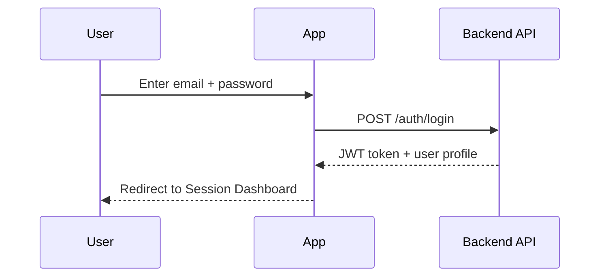
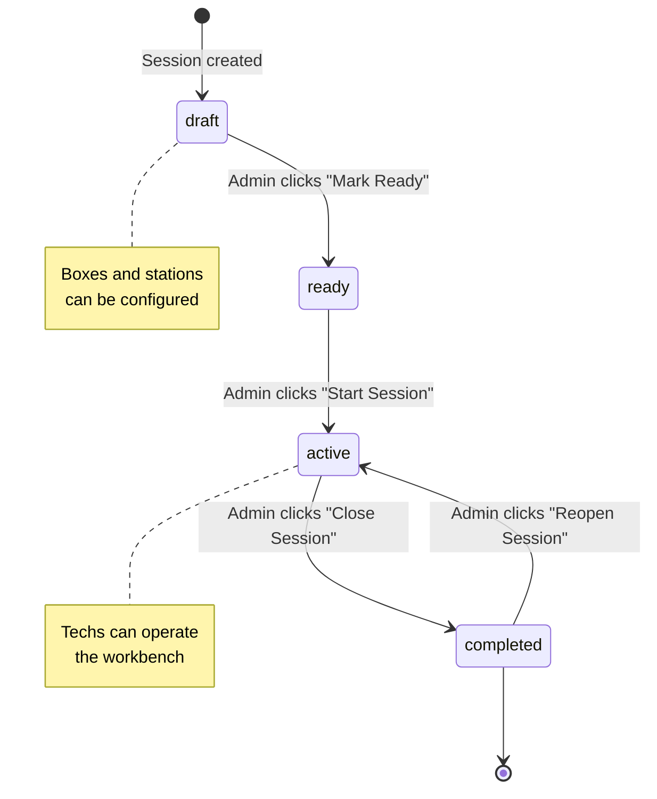
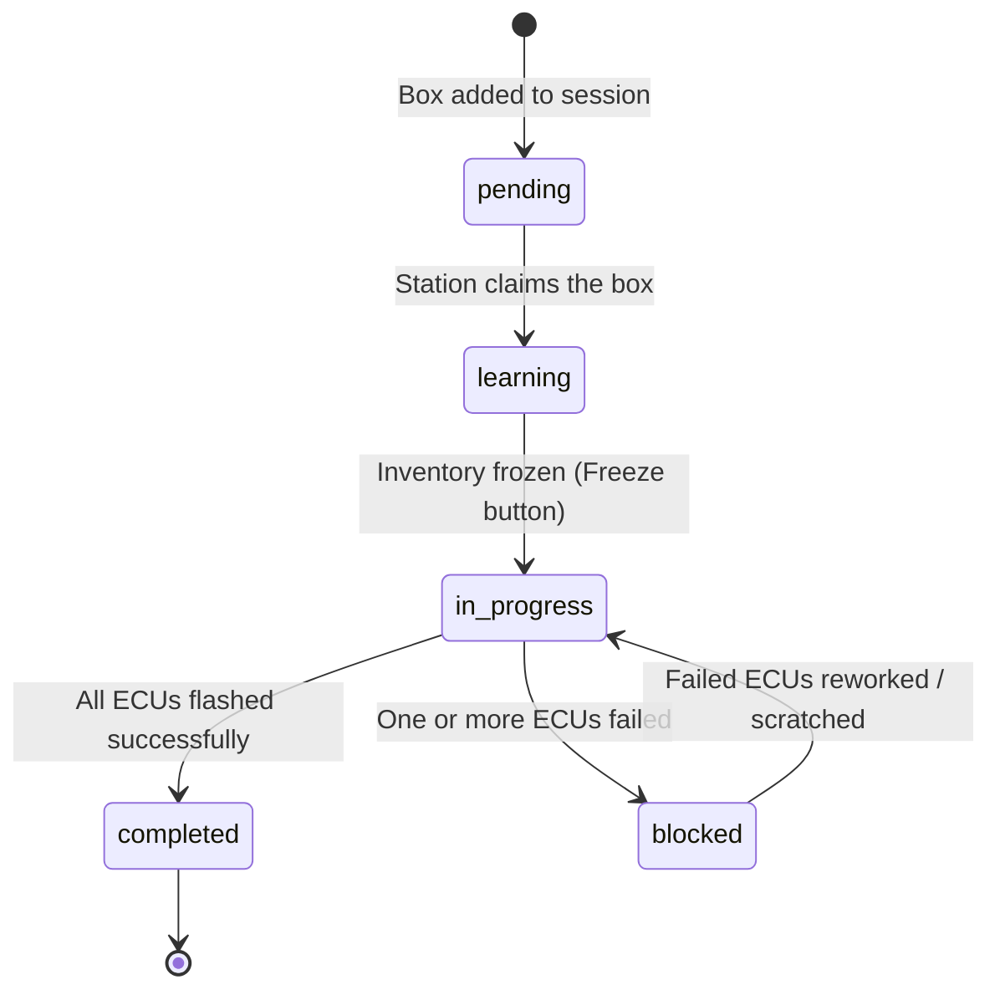
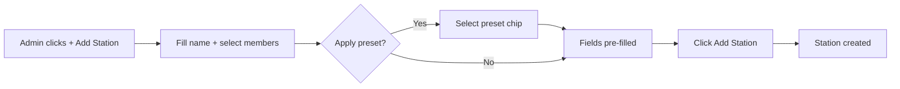
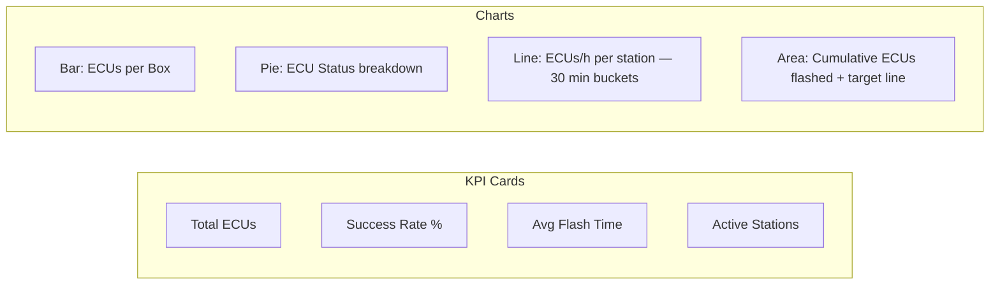
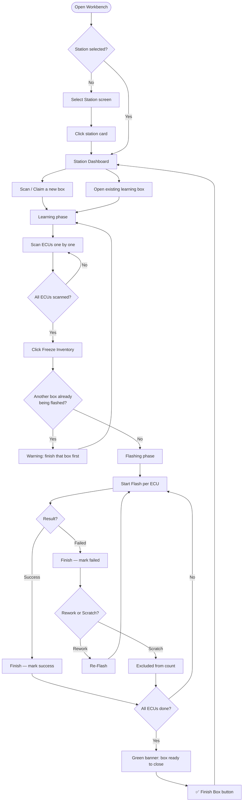
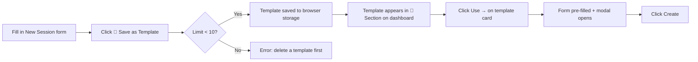
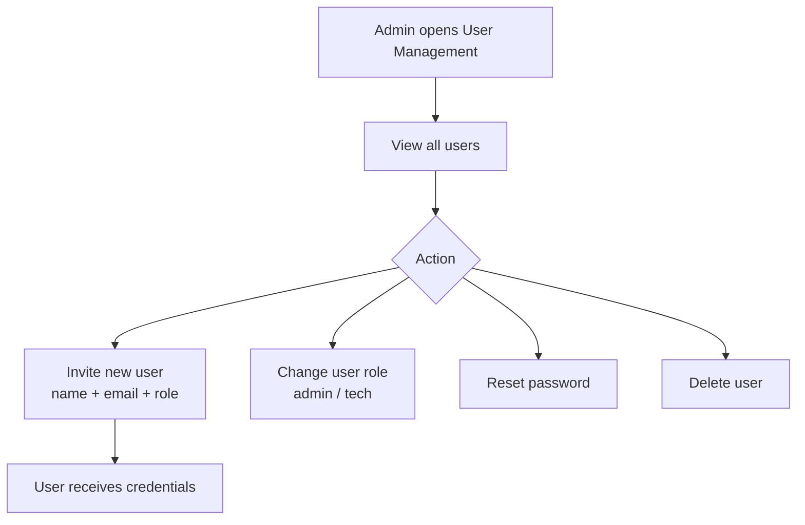
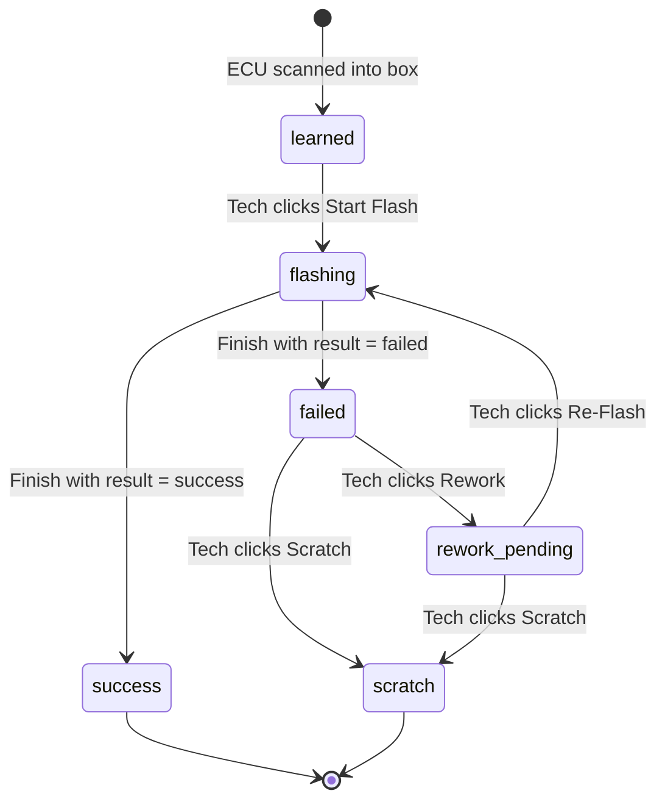

# ECU Reflash Tracker — User Manual

> **Version:** 1.0 · **Language:** English  
> A production-floor web application for tracking ECU learning and reflashing operations across multiple stations and work sessions.

---

## Table of Contents

0. [Installation & First-Time Setup](#0-installation--first-time-setup)
1. [Overview](#1-overview)
2. [Roles & Permissions](#2-roles--permissions)
3. [Logging In](#3-logging-in)
4. [Session Dashboard](#4-session-dashboard)
5. [Session Lifecycle](#5-session-lifecycle)
6. [Session Detail — Boxes Tab](#6-session-detail--boxes-tab)
7. [Session Detail — Stations Tab](#7-session-detail--stations-tab)
8. [Session Detail — Analytics Tab](#8-session-detail--analytics-tab)
9. [Station Workbench](#9-station-workbench)
10. [ECU Detail & Attachments](#10-ecu-detail--attachments)
11. [Session Templates](#11-session-templates)
12. [User Management](#12-user-management)
13. [Status Reference](#13-status-reference)
14. [Network Startup Script](#14-network-startup-script)

---

## 0. Installation & First-Time Setup

This section covers everything needed to run ECU Reflash Tracker on a **new machine** after copying the repository.

### Prerequisites

Only one tool needs to be installed: **Docker Desktop**.
It bundles Docker Engine, Docker Compose, and a GUI dashboard.

| Operating System | Download |
|---|---|
| Windows 10/11 | https://www.docker.com/products/docker-desktop |
| macOS | https://www.docker.com/products/docker-desktop |
| Ubuntu/Debian | `sudo apt install docker.io docker-compose-plugin` |

> **Windows note:** During Docker Desktop installation, enable **WSL 2 backend** when prompted (recommended). Restart the computer after installing.

### Minimum hardware

| Resource | Minimum |
|---|---|
| RAM | 4 GB free |
| Disk | 3 GB free (images + database) |
| Ports free | 3000, 8000, 5432, 9000, 9001 |

### Step-by-step: first run

**1. Copy or clone the repository** to any folder on the new machine.

```
ecu-reflash-tracker/
  backend/
  frontend/
  docker-compose.yml
  start-network.ps1   ← Windows network helper
  ...
```

**2. Start all services**

*Windows (PowerShell):*
```powershell
cd ecu-reflash-tracker
docker compose up --build
```

*Linux / macOS (Terminal):*
```bash
cd ecu-reflash-tracker
docker compose up --build
```

The first run downloads Docker images and builds the app (~3–5 minutes depending on internet speed). Subsequent starts take ~20 seconds.

**3. Wait until all containers are healthy**

You will see lines like:
```
✔ Container ecu-postgres   Healthy
✔ Container ecu-minio      Healthy
✔ Container ecu-backend    Started
✔ Container ecu-frontend   Started
```

**4. Open the app**

| URL | What it is |
|---|---|
| http://localhost:3000 | The web application |
| http://localhost:8000/docs | API documentation (Swagger) |
| http://localhost:9001 | MinIO file storage console (optional) |

**5. Log in with the default credentials**

| Role | Email | Password |
|---|---|---|
| Admin | `admin@local` | `admin123` |
| Tech | `tech@local` | `tech123` |

> Change passwords after the first login via **Profile → Change Password**.

### Make it accessible from other devices on the network

Run the network startup script instead of `docker compose up`:

```powershell
.\start-network.ps1
```

This auto-detects your LAN IP, patches `docker-compose.yml`, and rebuilds the frontend.
See [Section 14 — Network Startup Script](#14-network-startup-script) for full details.

### Stopping and restarting

```powershell
# Stop (keeps data)
docker compose down

# Start again (no rebuild needed)
docker compose up -d

# Full reset — deletes all data and rebuilds
docker compose down -v
docker compose up --build
```

### Troubleshooting

| Problem | Solution |
|---|---|
| Port already in use | Change the left side of the port mapping in `docker-compose.yml` (e.g. `"3001:3000"`) |
| Backend won't start | Run `docker compose logs backend` to read the error |
| Database empty after restart | Data is persisted in Docker volumes — it survives `down` but not `down -v` |
| Docker Desktop not running | Open Docker Desktop and wait for the whale icon to stop animating |

---

## 1. Overview

ECU Reflash Tracker organises the ECU flashing process into three levels:

```
Session  ──▶  Boxes  ──▶  ECUs
   │
   └──▶  Stations (physical flash benches)
```

| Concept | Description |
|---|---|
| **Session** | A production run (e.g. "Line A – Q1 Batch"). Groups related boxes. |
| **Box** | A physical box of ECUs to be processed. Goes through learning then flashing. |
| **ECU** | A single electronic control unit inside a box. |
| **Station** | A physical flash bench. One station can work on multiple boxes simultaneously (learning), but only flash **one box at a time**. |

---

## 2. Roles & Permissions

```mermaid
flowchart LR
    subgraph Admin
        A1[Create / delete sessions]
        A2[Create stations & assign members]
        A3[Add boxes to sessions]
        A4[Manage users]
        A5[Save session templates]
        A6[Download reports]
        A7[Change session status]
    end

    subgraph Tech
        T1[Add boxes to sessions]
        T2[Operate Station Workbench]
        T3[Scan ECUs]
        T4[Freeze inventory]
        T5[Flash ECUs]
        T6[Upload attachments]
    end

    Admin -->|can also do everything| Tech
```



> **Rule of thumb:** Admins configure the operation. Techs execute it on the floor.

---

## 3. Logging In

1. Open the application URL in your browser.
2. Enter your **email** and **password**.
3. Click **Login**.



After login, your name and avatar appear in the top-right navbar on every page. Click your name to open your **Profile** (change password, toggle language EN/ES).

---

## 4. Session Dashboard

The home screen. All sessions created in the system are listed here.

```
┌─────────────────────────────────────────────────────────┐
│  ⚡ ECU Reflash        👤 John          👤 Users  Logout │
├─────────────────────────────────────────────────────────┤
│  Flash Sessions                          [+ New Session] │
│                                                         │
│  Name            SW Version   Status    Created          │
│  ─────────────────────────────────────────────────────  │
│  Line A – Q1     v2.5.1-PROD  active   01 Mar 2026      │
│  Line B – Feb    v2.4.0       completed 14 Feb 2026     │
│                                                         │
│  ── 📁 Session Templates ──────────────────── 2 / 10 ── │
│  ┌──────────────────┐  ┌──────────────────┐            │
│  │ 📋 Line A Std    │  │ 📋 Full Batch     │            │
│  │ v2.5.1-PROD      │  │ v2.4.0-QA        │            │
│  │ [Use →]  [✕]     │  │ [Use →]  [✕]     │            │
│  └──────────────────┘  └──────────────────┘            │
└─────────────────────────────────────────────────────────┘
```

- Click any row to open that session.
- Click **+ New Session** (admin only) to create a session — see [Session Templates](#11-session-templates) to pre-fill the form.

---

## 5. Session Lifecycle

Sessions follow a strict state machine controlled by admins:



| Status | Colour | What it means |
|---|---|---|
| `draft` | grey | Being set up; not yet started |
| `ready` | yellow | Configured and cleared for start |
| `active` | blue | Production in progress |
| `completed` | green | All work done |

---

## 6. Session Detail — Boxes Tab

### 6.1 Views

Switch between **Kanban** (default, column-per-status) and **Grid** (compact card view) using the toggle buttons top-right.

```
┌─ Pending ──┐  ┌─ Learning ─┐  ┌─ In Progress ┐  ┌─ Blocked ──┐  ┌─ Completed ┐
│ BOX-001    │  │ BOX-003    │  │ BOX-005      │  │ BOX-007    │  │ BOX-009    │
│ BOX-002    │  │ BOX-004    │  │ BOX-006      │  │            │  │ BOX-010    │
└────────────┘  └────────────┘  └──────────────┘  └────────────┘  └────────────┘
```

### 6.2 Filtering & Sorting

| Control | Purpose |
|---|---|
| Search box | Filter by box serial number |
| Status dropdown | Show only one status |
| Station dropdown | Show only boxes of one station |
| Has Issues checkbox | Show only boxes with failed/scratch ECUs |
| Sort | Sort by serial, created date, completion, ECU count, or issue count |

### 6.3 Box Lifecycle



### 6.4 Box Detail Drawer

Click any box card to open the detail drawer on the right side:

- Summary KPIs (ECU counts, durations, station)  
- Full ECU list with status and flash time  
- Quick actions: change box status (admin), open workbench

### 6.5 Adding a Box

**Admin or Tech** can click **+ Add Box**:

| Field | Required | Description |
|---|---|---|
| Box Serial | ✅ | Unique identifier printed on the physical box |
| Expected ECU Count | optional | Pre-declared capacity; used for progress % |

---

## 7. Session Detail — Stations Tab

### 7.1 Station Cards

Each station card shows:
- Station name
- Assigned members
- Active box count and flash status

### 7.2 Adding a Station (Admin)

1. Click **+ Add Station**.
2. Enter a **Station Name** (e.g. "Station A").
3. Tick the members to assign (scrollable list with role badges).
4. Click **Add Station**.

Use **Saved Presets** (if any) to pre-fill name and members from a previous configuration.



### 7.3 Managing Station Members

Click a station card to open the **Station Detail Modal**:

- Add members via dropdown + "Agregar" button
- Remove members with the ✕ button
- Save the current config as a **Preset** (💾 button) for reuse

### 7.4 Navigating to Workbench

From the station card or the Station Detail Modal, click **Go to Workbench →** to open the station's operating screen.

---

## 8. Session Detail — Analytics Tab

Switch to the **Analytics** tab to see live production metrics.



| Chart | What it tells you |
|---|---|
| **ECUs per Box** | Which boxes have the most ECUs — helps spot outliers |
| **ECU Status Pie** | Overall success/failed/scratch proportion |
| **ECUs/h per Station** | Throughput trend per workbench over time |
| **Cumulative flashed** | Running total vs a target reference line |

Click **📥 Download Report** (admin) to export a full session CSV.

---

## 9. Station Workbench

The Workbench is the screen technicians use on the production floor. It has its own URL (`/sessions/:id/workbench`) and can be opened full-screen on a dedicated terminal.

### 9.1 Overall Workbench Flow



### 9.2 Station Dashboard

The central hub after selecting a station. Shows all boxes currently assigned to this station.

```
┌──────────────────────────────────────────────────────┐
│ 🏭 Station A                      [Change Station]   │
│                                                      │
│  Scan New Box                                        │
│  [BOX-SERIAL___________]  [Claim]                    │
│  ⚠ Finish flashing BOX-007 before starting another  │
│                                                      │
│  📖 LEARNING (2) ────────────────────────────────── │
│  📦 BOX-001  learning   12 ECUs        [Open →]     │
│  📦 BOX-002  learning    8 ECUs        [Open →]     │
│                                                      │
│  ⚡ FLASHING (1) ────────────────────────────────── │
│  📦 BOX-007  in_progress  20 ECUs      [Flash Table →] │
└──────────────────────────────────────────────────────┘
```

**Key rules:**
- ✅ Multiple boxes can be in **Learning** simultaneously  
- ❌ Only **one box** can be in **Flashing** at a time per station

### 9.3 Learning Phase

```
┌─────────────────────────────────────────────────────┐
│ [← Back]  Learning: BOX-001   12 ECUs scanned       │
│                               [🔒 Freeze Inventory] │
│                                                     │
│  [Scan ECU barcode…__________] [Add]                │
│                                                     │
│  #   ECU Code       Status                          │
│  1   ECU-AA001      learned                         │
│  2   ECU-AA002      learned                         │
│  …                                                  │
└─────────────────────────────────────────────────────┘
```

1. Scan (or type) each ECU barcode and press **Add**.
2. Once all ECUs are in, click **🔒 Freeze Inventory** to lock the list and start flashing.
3. Click **← Back** at any time to return to the dashboard without losing progress.

### 9.4 Flashing Phase

```
┌──────────────────────────────────────────────────────────────────┐
│ [← Back]  Flashing: BOX-007   15/20 done                        │
│                                                                  │
│  ECU Code    Status / Time   Attempts  Result  Notes  Action     │
│  ─────────────────────────────────────────────────────────────  │
│  ECU-001     ✅ success  ⏱ 2m30s   1         —       —          │
│  ECU-002     ⚡ flashing  ⏱ 01:15   1    [Success▼] [notes…] [Finish] │
│  ECU-003     ✗ failed    ⏱ 5m10s   2         —       [Rework] [🗑 Scratch] │
│  ECU-004     learned      —         —         —       [Start Flash] │
└──────────────────────────────────────────────────────────────────┘
```

| Action | When available | Description |
|---|---|---|
| **Start Flash** | Status = `learned` | Marks ECU as actively flashing; starts a live timer |
| **Finish** | Status = `flashing` | Records result (Success/Failed) and notes |
| **Rework** | Status = `failed` | Puts ECU back to `rework_pending` for a re-flash attempt |
| **🗑 Scratch** | Status = `failed` or `rework_pending` | Marks as damaged — excluded from counts, box can still close |

### 9.5 Completing a Box

When the last ECU is finished, **the flash table stays open** — the tech can review everything. A green banner appears:

```
┌────────────────────────────────────────────────────────────────┐
│ 🎉  All ECUs completed — box ready to close                   │
│     📖 2 boxes in learning waiting to be frozen         [✅ Finish Box] │
└────────────────────────────────────────────────────────────────┘
```

Click **✅ Finish Box** to:
1. Mark the box as completed
2. Return to the Station Dashboard
3. See a toast notification with the count of learning boxes ready to freeze

### 9.6 Blocked Boxes

If any ECU finishes with `failed` status and is not reworked/scratched, the box becomes **Blocked**. A dedicated blocked screen appears with two options:

- **← Back** — return to dashboard without changing anything
- **View Flash Table** — open the flash table to rework the failed ECUs

---

## 10. ECU Detail & Attachments

Click any ECU code (underlined) anywhere in the app to open the **ECU Detail Modal**.

```
┌─────────────────────────────────────────────────────┐
│  ECU-AA001                                    [✕]   │
│  ┌──────────┬──────────────┬───────────────────┐   │
│  │ Details  │ Flash History│ Attachments        │   │
│  └──────────┴──────────────┴───────────────────┘   │
│                                                     │
│  Details tab:                                       │
│  Status:  success         Version:  v2.5.1          │
│  Attempts: 2              Last duration: 2m 18s     │
│                                                     │
│  Flash History tab:                                 │
│  #  Started        Duration  Result   Notes         │
│  1  01/03 09:15    5m 10s    failed   cable issue   │
│  2  01/03 09:24    2m 18s    success  —             │
│                                                     │
│  Attachments tab:                                   │
│  Type: [photo ▼]  Notes: [____________]             │
│  [📎 Choose file]                                   │
│  ─────────────────────────────────                 │
│  photo  — cable_check.jpg         [↓ Download]     │
└─────────────────────────────────────────────────────┘
```

**Uploading an attachment:**
1. Open the **Attachments** tab.
2. Select a **Type** (photo, log, other).
3. Add optional notes.
4. Click **📎 Choose file**, select the file, and it uploads automatically.

---

## 11. Session Templates

Templates let admins save and reuse session configurations (name + SW version) without re-typing.



- Maximum **10 templates** stored per browser.
- Templates are stored locally in the browser (`localStorage`) — they are per-device.
- Duplicate templates (same name + version) are rejected.
- Delete a template with the **✕** button on its card.

---

## 12. User Management

Available to **admins** via the 👤 **Users** button in the navbar.



| Role | Can be changed to |
|---|---|
| `tech` | `admin` |
| `admin` | `tech` |

---

## 13. Status Reference

### Session Statuses

| Status | Badge colour | Meaning |
|---|---|---|
| `draft` | grey | Created, not yet ready for production |
| `ready` | yellow/amber | Configured; cleared by admin |
| `active` | blue/primary | In production |
| `completed` | green | Closed |

### Box Statuses

| Status | Meaning |
|---|---|
| `pending` | Added to session, not yet claimed by a station |
| `learning` | Station claimed it; ECUs being scanned |
| `in_progress` | Inventory frozen; flashing in progress |
| `blocked` | One or more ECUs failed and need rework |
| `completed` | All ECUs done successfully |

### ECU Statuses



| Status | Colour | Counts toward completion? |
|---|---|---|
| `learned` | purple | — |
| `flashing` | violet | — |
| `success` | green | ✅ Yes |
| `failed` | red | Blocks box completion |
| `rework_pending` | amber | — |
| `scratch` | grey | Excluded (does not block) |

---

## 14. Network Startup Script

`start-network.ps1` is a PowerShell script that auto-detects your current LAN IP,
updates `docker-compose.yml`, and rebuilds + restarts the stack.
Run it any time you change networks (office, home, client site).

### Basic usage

```powershell
# From the project root — detects LAN IP automatically
.\start-network.ps1
```

### Options

| Flag | Default | Description |
|---|---|---|
| `-IP <address>` | _(auto)_ | Force a specific IP instead of auto-detecting |
| `-FrontendPort <n>` | `3000` | Change the frontend port |
| `-BackendPort <n>` | `8000` | Change the backend port |
| `-OpenFirewall` | _(off)_ | Add Windows Firewall inbound rules (**requires admin**) |

### Examples

```powershell
# Force a specific IP (e.g. connected via VPN or Ethernet)
.\start-network.ps1 -IP 10.0.0.5

# Use different ports
.\start-network.ps1 -FrontendPort 8080 -BackendPort 9000

# Open firewall ports (run PowerShell as Administrator)
.\start-network.ps1 -OpenFirewall
```

### What it does step by step

1. **Detects LAN IP** — scans active network adapters, prefers Wi-Fi over Ethernet, skips loopback/WSL/APIPA.
2. **Patches `docker-compose.yml`** — replaces `VITE_API_URL` and `FRONTEND_URL` with the detected IP.
3. **Rebuilds containers** — runs `docker compose up -d --build frontend backend`.
4. **Prints access URLs** at the end:

```
  Local  : http://localhost:3000
  Network: http://192.168.1.27:3000
  API    : http://192.168.1.27:8000
```

> **Note:** `VITE_API_URL` is baked into the frontend bundle at build time, so a rebuild is required whenever the IP changes.

---

*For technical setup and deployment instructions see [QUICKSTART.md](QUICKSTART.md).*
